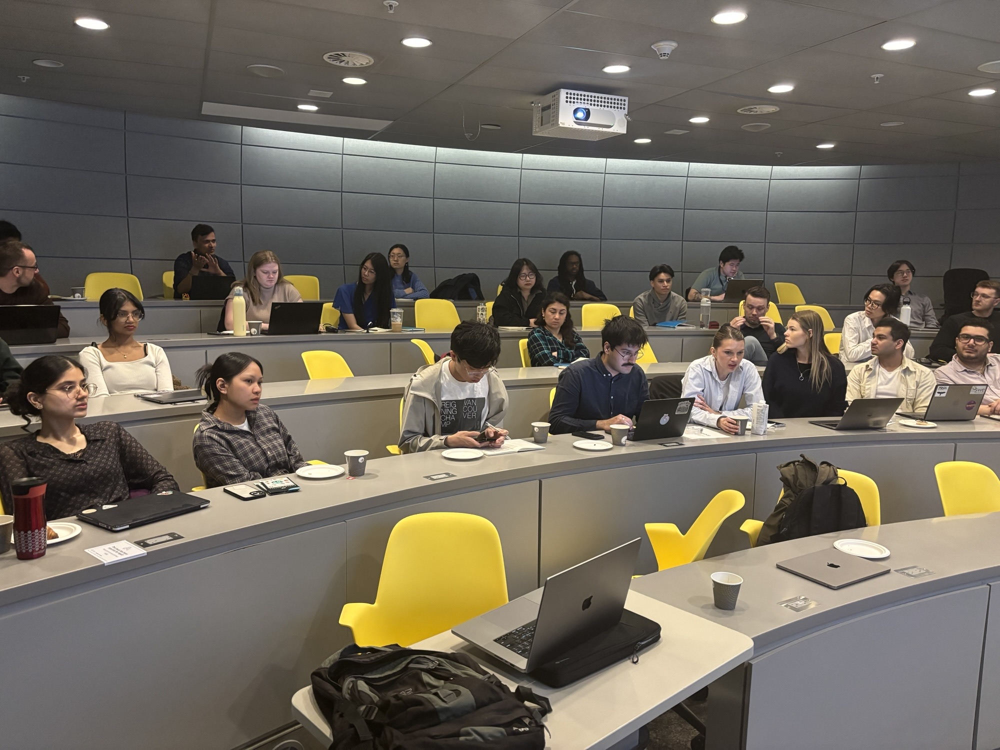

We joined remotely to the [conference](https://meetings.embo.org/event/25-immunobiophysics) located in France, along with U Oxford, UK; IISc in Bengaluru, India; and Institut Curie, Paris.

Meghan and Eric also gave talks on their research projects examining lymph node trafficking of DNA origami and tuning DNA origami immunogenicity

<!--more-->

