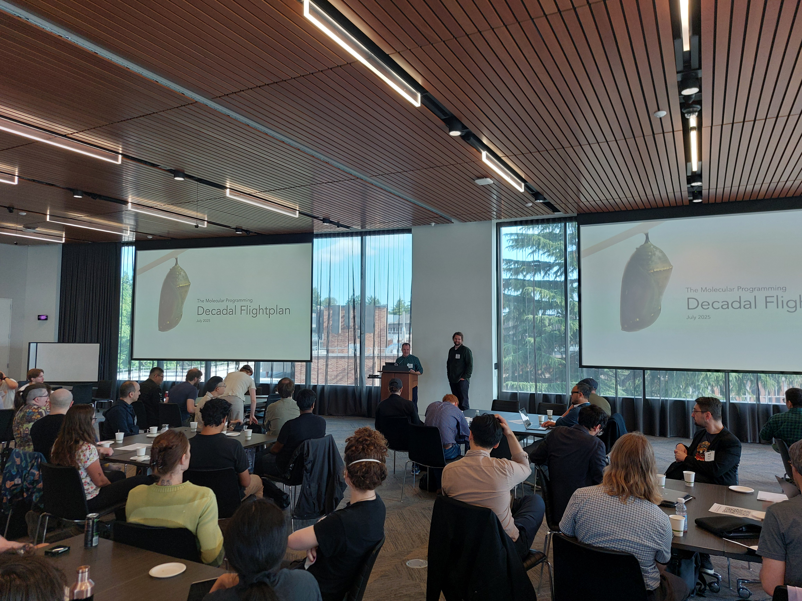
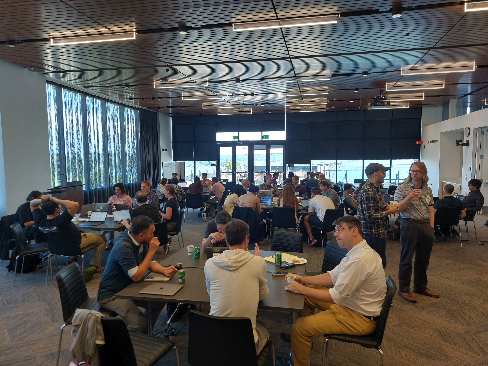

The [Molecular Programming Decadal Flightplan](https://www.mpflightplan.com/) workshop is a community-driven, NSF-funded initiative to define a shared vision for the Molecular Programming field. This 3-day in-person conference brings together researchers to assess the state of molecular programming, develop a ten-year strategy for growing the field, and identify breakthrough technologies and collaborations that will accelerate our impact across science, medicine, materials, and beyond. Happy to meet many new and old friends while discussing the future of this forward looking field.

